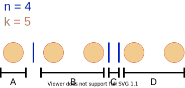

# Algebra

## Greatest Common Divisor
*Greatest Common Divisor (GCD)* is the largest number which is a divisor of all given numbers. We can compute `GCD(a,b)` in `O(log(min(a,b)))`.

The two implementations are available.
*Binary GCD* is a little bit more efficient than standard one by using only binary operations.
- [GCD | C++ code](gcd.hpp)
- [Binary GCD | C++ code](bingcd.hpp)

### References in English
- [Euclidean algorithm for computing the greatest common divisor - Competitive Programming Algorithms](https://cp-algorithms.com/algebra/euclid-algorithm.html)

### Challenges
- [GCD and LCM | CodeChef](https://www.codechef.com/problems/FLOW016)
- [Greatest Common Divisor - AOJ ALDS1B](https://onlinejudge.u-aizu.ac.jp/courses/lesson/1/ALDS1/1/ALDS1_1_B)
- [Disjoint Set of Common Divisors - AtCoder ABC142D](https://atcoder.jp/contests/abc142/tasks/abc142_d)

## Least Common Multiple
*Least Common Multiple (LCM)* is the smallest number which is a multiple of all given numbers. We can also compute `LCM(a,b)` in `O(log(min(a,b)))`.

- [LCM | C++ code](lcm.hpp)

### References in English
- [Euclidean algorithm for computing the greatest common divisor - Competitive Programming Algorithms](https://cp-algorithms.com/algebra/euclid-algorithm.html)

### Challenges
- [GCD and LCM | CodeChef](https://www.codechef.com/problems/FLOW016)
- [Least Common Multiple - AOJ NTL1C](https://onlinejudge.u-aizu.ac.jp/courses/library/6/NTL/1/NTL_1_C)


## Binary Exponentiation

Binary exponentiation is a way to calculate the `n`-th power of `a` in `O(log(n))`.
The algorithm requires only `O(log(n))` multiplications.

[Binary Exponentiation | C++ code](binexp.hpp)

### References in English
- [Binary Exponentiation - Competitive Programming Algorithms](https://cp-algorithms.com/algebra/binary-exp.html)

### Challenges
- [Power - AOJ NTL1B](https://onlinejudge.u-aizu.ac.jp/courses/library/6/NTL/1/NTL_1_B)


## Prime Factorization
*Prime Factorization* or *Integer Factorization* is a way to break a number into a set of prime numbers. All numbers in the set multiply together to result in the original number.

- [Trivial | C++ code](prime_factorization_basic.hpp) in `O(sqrt(N))`

### References in English
- [Integer Factorization - Competitive Programming Algorithms](https://cp-algorithms.com/algebra/factorization.html)

### Challenges
- [Prime Factorization - AOJ NTL1A](https://onlinejudge.u-aizu.ac.jp/courses/library/6/NTL/1/NTL_1_A)
- [Factorization - AtCoder ABC110D](https://atcoder.jp/contests/abc110/tasks/abc110_d)
- [Disjoint Set of Common Divisors - AtCoder ABC142D](https://atcoder.jp/contests/abc142/tasks/abc142_d)


## Binomial Coefficients
Binomial coefficients `(n,k)` are the number of ways to pick a set of `k` elements up from `n` different elements.
The order of elements picked up is not taken into account.

- [Binomial Coefficients using Pascal's Triangle | C++ code](combination_pascal.hpp)  
  - Precomputation in `O(N**2)`
  - Calculation in `O(1)`
- [Binomial Coefficients in Modulo | C++ code](combination_basic.hpp)  
  - Precomputation in `O(N)`
  - Calculation in `O(1)`

### References in English
- [Binomial Coefficients - Competitive Programming Algorithms](https://cp-algorithms.com/combinatorics/binomial-coefficients.html)

### References in Japanese
- [競プロでよく使う二項係数(nCk)を素数(p)で割った余りの計算と逆元のまとめ | アルゴリズムロジック](https://algo-logic.info/combination/)

### Combination with repetition
[Number of combinations with repetition | Combination - Wikipedia](https://en.wikipedia.org/wiki/Combination#Number_of_combinations_with_repetition)

```math
((n, k)) = (n + k - 1, k)
```
```math
H(n,k) = C(n+k-1,k)
```



### Challenges
- [多重ループ - AtCoder ABC021D](https://atcoder.jp/contests/abc021/tasks/abc021_d)
- [経路 - AtCoder ABC034C](https://atcoder.jp/contests/abc034/tasks/abc034_c)
- [いろはちゃんとマス目 - AtCoder ABC042D](https://atcoder.jp/contests/abc042/tasks/arc058_b)
- [Maximum Average Sets - AtCoder ABC057D](https://atcoder.jp/contests/abc057/tasks/abc057_d)
- [Factorization - AtCoder ABC110D](https://atcoder.jp/contests/abc110/tasks/abc110_d)
- [E - Cell Distance](https://atcoder.jp/contests/abc127/tasks/abc127_e)
- [D - Bouquet](https://atcoder.jp/contests/abc156/tasks/abc156_d)
- [E - Roaming](https://atcoder.jp/contests/abc156/tasks/abc156_e)
- [E - Colorful Blocks](https://atcoder.jp/contests/abc167/tasks/abc167_e)


## Extended Euclidean Algorithm
*Extended Euclidean Algorithm* is a way to compute a integer solution `(x,y)` of `ax + by = gcd(a,b)`.
We can compute the solution in `O(log(min(a,b)))`.

- [Extended Euclidean Algorithm (iterative solution) | C++ code](extgcd_iterative.hpp)
- [Extended Euclidean Algorithm (recursive solution) | C++ code](extgcd_recursive.hpp)

### References in English
- [Extended Euclidean Algorithm - Competitive Programming Algorithms](https://cp-algorithms.com/algebra/extended-euclid-algorithm.html)

### Challenges
- [Extended Euclidean Algorithm - AOJ NTL1E](https://onlinejudge.u-aizu.ac.jp/courses/library/6/NTL/1/NTL_1_E)


## Modular Multiplcative Inverse
A *Modular Multiplicative Inverse* of an integer `a` is an integer `x` such that the product `ax` is congruent to 1 in modulus `m`.
```math
ax = 1 (mod m)
x = a^{-1} (mod m)
```

- [Modular Multiplicative Inverse (using Fermat's little theorem and Binary Exponentation) | C++ code](modinv_binexp.hpp)
- [Modular Multiplicative Inverse (using Extended Euclidean Algorithm) | C++ code](modinv_extgcd.hpp)
- [All Modular Multiplicative Inverse | C++ code](modinvall.hpp)

### References in English
- [Modular multiplicative inverse - Wikipedia](https://en.wikipedia.org/wiki/Modular_multiplicative_inverse)
- [Modular Inverse - Competitive Programming Algorithms](https://cp-algorithms.com/algebra/module-inverse.html)

### Challenges
- [D - 動的計画法](https://atcoder.jp/contests/abc024/tasks/abc024_d)
- [E - Flatten](https://atcoder.jp/contests/abc152/tasks/abc152_e)
- [E - Throne](https://atcoder.jp/contests/abc186/tasks/abc186_e)
