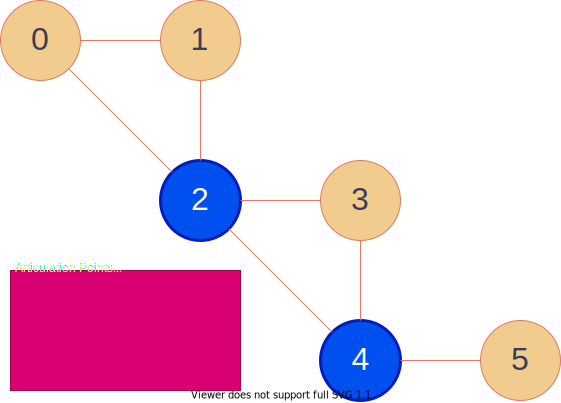

# Graph Algorithms

## Articulation Points
An articulation Point (or a cut vertex) is a vertex.
If we remove the vertex from a graph, it makes the graph disconnected.
A graph may have zero or more articulation points.
We can find all articulation points of a given graph in `O(V + E)`.

[Articulation Points | C++ code](articulation_points.hpp)

## References in English
- [Finding articulation points in a graph in O(N+M) | E-Maxx Algorithms in English](https://cp-algorithms.com/graph/cutpoints.html)

### Challenges
- [Articulation Points | AOJ GRL3A](https://onlinejudge.u-aizu.ac.jp/problems/GRL_3_A)

## Bridges
🚧

## Topological Sort
🚧

## Strongly Connected Components
🚧

## Single-Source Shortest Paths

### Dijkstra
🚧

### Bellman-Ford
🚧

### SPFA
🚧

### Challenges
- [トレジャーハント - AtCoder ABC035D](https://atcoder.jp/contests/abc035/tasks/abc035_d)

## All-Pairs Shortest Paths

### Floyd-Warshall
🚧

### Challenges
- [正直者の高橋くん - AtCoder ABC021C](https://atcoder.jp/contests/abc021/tasks/abc021_c)
- [Blue Bird - AtCoder ABC022C](https://atcoder.jp/contests/abc022/tasks/abc022_c)

## Bipartite

### Bipartite Check
🚧

### Bipartite Maximum Matching
🚧

## Cycle

### Finding Cycle
🚧

### Finding Negative Cycle
🚧

## Minimum Spanning Tree
🚧

## Minimum Cost Arborescence
🚧

## Maximum Flow
🚧

## Minimum Cut
🚧

## Minimum Cost Flow
🚧