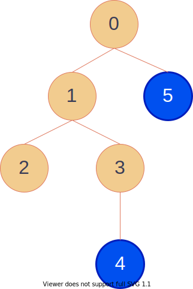
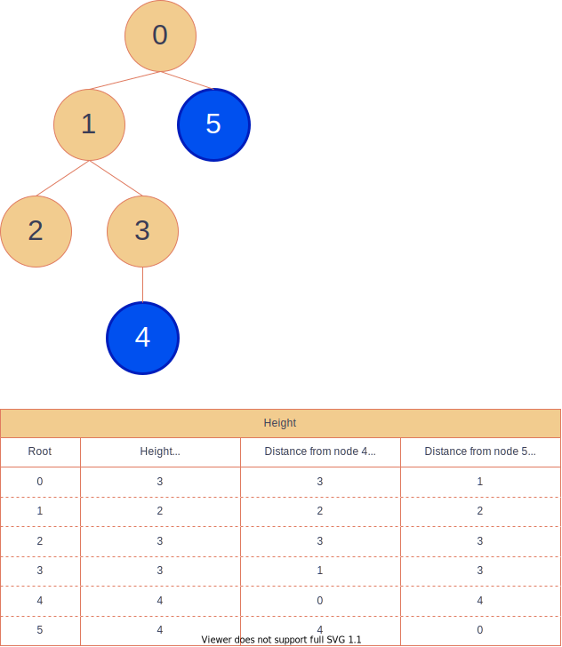

# Tree Algorithms

## Diameter
*Diameter of a Tree* is the maximum distance between two nodes in a tree.
*Diameter* is unique even if we pick any root node from the tree.
We can calculate *Diameter* in `O(V)`. `V` is the number of nodes.

[Diameter of Tree | C++ code](diameter.hpp)

### References in English
- [Diameter of a tree using DFS - GeeksforGeeks](https://www.geeksforgeeks.org/diameter-tree-using-dfs/)
- [Diameter of a Binary Tree - GeeksforGeeks](https://www.geeksforgeeks.org/diameter-of-a-binary-tree/)

### References in Japanese
- [木の直径](http://www.prefield.com/algorithm/graph/tree_diameter.html)

### Challenges
- [Diameter of a Tree - AOJ GRL5A](https://onlinejudge.u-aizu.ac.jp/problems/GRL_5_A)
- [高橋くんと木の直径 - AtCoder ABC019D](https://atcoder.jp/contests/abc019/tasks/abc019_4)

## Height
*Height of a tree* is a max distance between a root node and another node in a tree.
*Height* is dependent on a root node we picked up.
Using *Diameter*, we can calculate all heights of a tree against any root node efficiently. The time complexity is `O(V)`. `V` is the number of nodes.

[Height of Tree | C++ code](height.hpp)

### References in Japanese
- [木の高さ](http://www.prefield.com/algorithm/graph/tree_height.html)

### Challenges
- [Height of a Tree - AOJ GRL5B](https://onlinejudge.u-aizu.ac.jp/problems/GRL_5_A)

## Euler Tour

*Euler Tour Representation* of a Tree allows efficient updates and queries against a subtree of the tree.
We can compute *Euler Tour Representation* in `O(V)` where `V` is the number of nodes.

[Euler Tour of Tree | C++ code](euler_tour.hpp)

### References in English
- [Euler tour technique](https://en.wikipedia.org/wiki/Euler_tour_technique)
- [Euler Tour of Tree](https://www.geeksforgeeks.org/euler-tour-tree/)
- [On Euler tour trees](https://codeforces.com/blog/entry/18369)

### Challenges
- [Range Query on a Tree - AOJ GRL5D](https://onlinejudge.u-aizu.ac.jp/problems/GRL_5_D)

## Heavy Light Decomposition
🚧 WIP

[Heavy Light Decomposition | C++ code](heavy-light-decomposition.hpp)

### References in English

- [Heavy Light Decomposition of tree](https://iq.opengenus.org/heavy-light-decomposition/)
- [Heavy Light Decomposition | Set 1 (Introduction) - GeeksforGeeks](https://www.geeksforgeeks.org/heavy-light-decomposition-set-1-introduction/)
- [Heavy Light Decomposition | Set 2 (Implementation) - GeeksforGeeks](https://www.geeksforgeeks.org/heavy-light-decomposition-set-2-implementation/)
- [(Tutorial) Heavy-Light Decomposition](https://discuss.codechef.com/t/tutorial-heavy-light-decomposition/69423)
- [Heavy-light decompositon — it can be simple!](https://codeforces.com/blog/entry/12239)
- [Easiest HLD with subtree queries](https://codeforces.com/blog/entry/53170)
- [Heavy-light decomposition implementation](https://codeforces.com/blog/entry/22072)

### References in Japanese
- [Heavy-Light Decomposition - beet's soil](https://beet-aizu.hatenablog.com/entry/2017/12/12/235950)
- [Heavy-Light Decomposition - math314のブログ](https://math314.hateblo.jp/entry/2014/06/24/220107)
- [HL分解(Heavy-Light-Decomposition)](https://ei1333.github.io/luzhiled/snippets/tree/heavy-light-decomposition.html)

### Challenges
- [Tree / 木 - AOJ 2667](https://onlinejudge.u-aizu.ac.jp/problems/2667)
- [Do use segment tree - AOJ 2450](https://onlinejudge.u-aizu.ac.jp/problems/2450)

## Lowest Common Ancestor
*Lowest Common Ancestor (LCA)* is the lowest ancestors of given nodes.
In particular, if node `u` is an ancestor of node `v`, then node `u` is the lowest common ancestor of `u` and `v`.
We can compute *LCA* in several ways below.

- [LCA | Binary Lifting | C++ code](lowest-common-ancestor/lca-binary-lifting.hpp)
- [LCA | Segment Tree | C++ code](lowest-common-ancestor/lca-segment-tree.hpp)
- [LCA | Farach-Colton and Bender Algorithm | C++ code](lowest-common-ancestor/lca-farach-colton-bender.hpp)
- [LCA | Tarjan's off-line Algorithm | C++ code](lowest-common-ancestor/lca-tarjan.hpp)

### References in English
- [LCA | Binary Lifting](https://cp-algorithms.com/graph/lca_binary_lifting.html)
- [LCA | Segment Tree](https://cp-algorithms.com/graph/lca.html)
- [LCA | Farach-Colton and Bender Algorithm](https://cp-algorithms.com/graph/lca_farachcoltonbender.html)
- [LCA | Tarjan's off-line Algorithm](https://cp-algorithms.com/graph/lca_tarjan.html)

### Challenges
- [LCA: Lowest Common Ancestor - AOJ GRL5C](https://onlinejudge.u-aizu.ac.jp/problems/GRL_5_C)